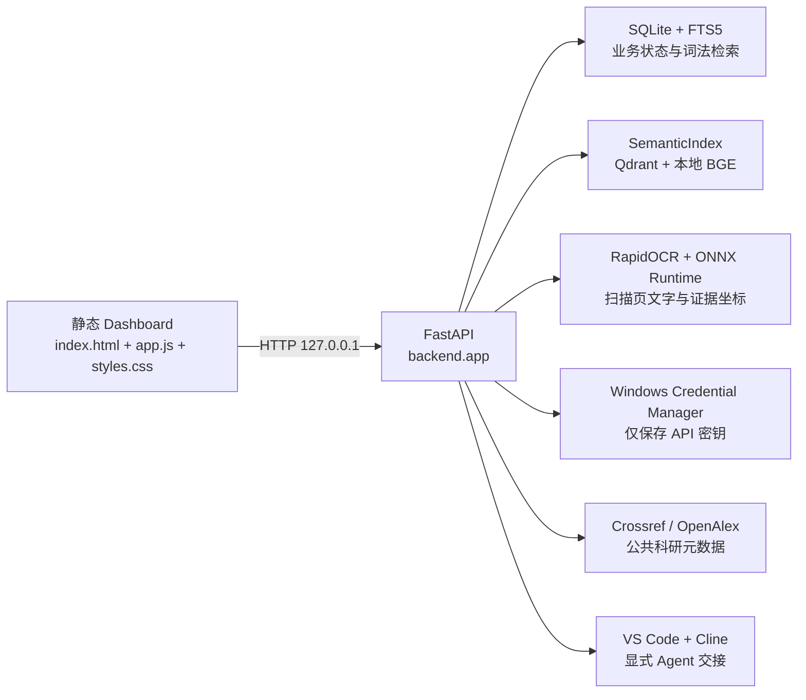

# Nexus AI-PC Dashboard 设计与交接说明

版本：2026-08-06 · 面向接手开发的工程说明

这份文档说明系统为什么这样组织、哪些边界不能破坏，以及新功能应该接在哪一层。运维命令和数据备份步骤见 [README.md](README.md)；当前完成情况和优先级见 [PROJECT_STATUS.md](PROJECT_STATUS.md)。

## 1. 目标与非目标

Dashboard 是单用户、本机优先的工作台。它把本地资料、学习证据、科研记录、凭据状态和 Agent 交接统一到一个 FastAPI 服务中；SQLite 是业务状态的权威来源，Qdrant 只负责可重建的语义索引。

当前明确不做的事情：

- 不把 Dashboard 变成公网服务或多用户权限系统。
- 不把 API 密钥写入 SQLite、浏览器存储、任务 Markdown、日志或命令参数。
- 不把“演示数据”当作真实活动；新数据库只能由用户动作产生记录。
- 不让网页静默执行文件删除、安装、外发、账号操作或电脑控制。
- 不把 DeepTutor、Codex CLI、Zotero 或 OpenAdapt 当作不可替换的核心依赖。

## 2. 产品定位与长期原则

### 2.1 图书馆与调度中心，而不是另一个聊天框

Dashboard 的核心产品不是要求用户一直停留在网页里，而是维护一个可检索、可引用、可复用的长期知识底座，并把不同的 AI 工具和执行入口连接起来。用户可以继续使用更成熟的 Codex、CLI、VS Code、Obsidian 或其他工具；Dashboard 负责提供上下文、资料、学习证据、科研记录、任务状态和审计。

因此，后续需要设计稳定的“桥梁层”，而不是强迫用户迁移到网页：

- CLI、skills、MCP 和网页都应调用同一组只读检索、学习进度、科研记录和任务接口。
- Dashboard -> 执行器时发送精简的上下文包：任务编号、目标、相关资料 ID/路径、引用位置、约束、测试要求和审批状态；默认不复制整个资料库。
- 执行器 -> Dashboard 时回写结果摘要、引用、产物路径、测试结果、版本/commit 和待确认事项；原始长对话仍可留在用户选择的执行器中。
- 任务、资料和结果使用稳定 ID、内容哈希和绝对路径关联，避免依赖某一家模型的会话历史。
- 桥梁层不能静默继承个人 Codex 登录态，也不能绕过现有的本机同源、工作区白名单和显式交接规则。

“同步”首先意味着状态和引用可互相定位，不意味着把所有隐私内容复制到每个工具。CLI/skills 的具体命令格式属于后续设计；在格式稳定前，优先使用版本化任务文件和已有 API。

### 2.2 多模型协作与成本/质量路由

模型不应按“一个模型包办一切”设计。路由应该按任务的质量要求、隐私级别、延迟、上下文长度、工具能力和预算选择模型，并允许用户覆盖默认选择。一个可评估的初始分工是：

| 工作 | 默认倾向 | 原因 |
|---|---|---|
| 文件分类、去重、标题/标签候选、格式清理 | 成本较低的模型或本地规则 | 高吞吐、可重试，错误容易被复核 |
| Embedding、关键词检索、初步召回 | 本地模型和 SQLite/Qdrant | 数据不外发、成本稳定 |
| 资料摘要、学习卡片草稿、科研候选整理 | 中等成本模型 | 需要语言能力，但不一定需要最强推理 |
| 跨文献综合、矛盾分析、复杂教学解释 | 更强模型 | 质量和证据整合优先 |
| 事实核查、反方论证、最终审阅 | 独立的批评/核查模型或第二次调用 | 降低单模型自证和讨好风险 |

低价不等于适合：模型选择仍要记录能力、隐私、可靠性和失败后的回退策略。每次真实调用应记录规范化的 provider、model、角色、耗时、估算成本、来源和错误码；用户可以查看并修改角色路由，系统不能擅自把敏感资料发给更便宜但不合适的服务。

### 2.3 “图书馆”知识生命周期

图书馆隐喻是系统的核心模型：书籍、论文、实验记录、数据集和用户笔记是长期资料；对话只是临时阅读会话。理想的数据流是：

```text
资料/实验结果 -> 解析与规范化 -> 可引用片段 -> 关键词/语义索引
    -> 证据卡片与概念 -> 学习计划/科研项目 -> 用户确认后的长期笔记
```

AI 可以整理、归纳和提出卡片，但不能把未经确认的生成内容冒充原始事实。每条结论都应能追溯到来源片段、页码/段落、检索式、模型和时间；实验结果还应保留数据版本、代码版本和复现条件。这样即使更换模型、网页或执行器，长期学习与科研仍然连续。

### 2.4 科学方法、开放搜索与反讨好

系统的提示词和工作流应鼓励查证，而不是只顺着用户的初始判断：

- 对事实性、争议性、时效性或专业性问题，默认考虑网络检索和本地资料的组合；记录查询、时间、来源和失败情况，不把搜索结果直接当作事实。
- 明确区分“来源事实”“模型推断”“用户假设”“待验证建议”和“行动决定”。用户提供的判断是重要上下文，但默认是待检验假设，不是系统必须认同的答案。
- 输出至少包含证据、反例/替代解释、剩余不确定性和下一步验证方法。证据不足时应明确说不知道，而不是用礼貌语气填空。
- 对高风险结论使用第二来源、第二模型或人工复核；不能为了让用户满意而压低反对意见，也不能把“反对用户”本身当作科学性。
- 外部搜索必须遵守隐私和最小外发原则：查询尽量去除个人信息，敏感资料默认只在本地检索，发送前保留审批边界。

“不讨好”应体现为可解释的证据冲突和不确定性，而不是武断、居高临下或拒绝用户目标。系统帮助用户更好地判断，最终决定权仍属于用户。

### 2.5 自主发现与受控更新

系统可以主动发现重复劳动、失败率上升、检索质量下降、用户反复修正或更好的开源工具，并提出改进观点；但“自主更新”必须是受控的软件工程流程，不能直接修改正式目录或生产数据：

```text
发现信号 -> 形成改进提案 -> 隔离工作区/分支 -> 测试与基准评估
  -> 人工审阅与批准 -> 一致性备份 -> 小范围部署 -> 观察/回滚 -> 记录变更
```

自动化可以完成提案、实验、补丁和报告；默认不能自动合并、安装、删除、外发或发布。每次更新都要有版本、变更原因、测试证据、资源/费用影响、迁移方案和回滚点。系统的“自主性”优先用于发现问题和准备可审阅的改进，而不是获得无限操作权限。

### 2.6 设计判断

以上原则把项目的长期价值放在“可迁移的知识和调度能力”上，而不是某个网页或模型品牌。实现新功能时，先问它是否增强了资料可追溯性、跨工具连续性、学习/科研质量或用户控制；如果只是增加一个孤立的聊天按钮，应暂缓。

## 3. 运行拓扑



正式部署目录是 `C:\AI-PC\app\dashboard`，开发 Git 工作区是 `C:\AI-PC\workspaces\ai-pc-dashboard`。开发 Agent 只能修改后者；部署前应停服务、备份正式数据库、审阅 diff，再把已验证的源码同步到正式目录。开发测试使用工作区 `.venv` 和临时数据库，不要指向正式数据库。

服务生命周期由 `create_app()` 管理：启动时初始化数据库、创建文献客户端和语义索引，退出时关闭外部客户端。测试通过依赖注入替换数据库路径、HTTP transport、凭据后端、语义索引和 Agent 交接器。

## 4. 后端模块边界

| 模块 | 责任 | 不应承担的责任 |
|---|---|---|
| `backend/app.py` | 组装依赖、业务路由、输入校验、状态码和审计 | 解析 PDF、实现 FSRS 或直接拼 SQL 业务流程 |
| `backend/bridge.py` | 版本化任务信封、结果解码和内容哈希 | 执行任务、读取凭据或绕过结果回写确认 |
| `backend/cli.py` | Codex/CLI 的本机 API 客户端、任务结果和协作入口 | 保存登录态、直接读取 SQLite 或执行任意 shell |
| `backend/improvements.py` | 从非敏感失败指标生成去重改进信号和提案 | 自动部署、修改正式目录或替用户批准实验 |
| `backend/system_routes.py` | 健康、总览、工具注册表和审计等低耦合系统路由 | 持有业务状态或执行模型、文件和网络副作用 |
| `backend/database.py` | SQLite schema、迁移、事务、查询和领域写入 | 调用网络、读取密钥、执行外部副作用 |
| `backend/library.py` | 路径白名单、文件发现、PDF/Markdown/TXT 解析和分块 | 改写原始文件或绕过白名单 |
| `backend/ocr.py` | OCR 引擎协议、RapidOCR 延迟初始化、坐标与置信度规范化 | 修改原 PDF、调用外部视觉服务或决定业务状态 |
| `backend/semantic.py` | 本地 embedding、Qdrant 索引、语义/混合检索和降级 | 作为业务数据的唯一来源 |
| `backend/learning.py` | FSRS 卡片、评分、掌握度和到期时间计算 | 生成没有答题证据的掌握度 |
| `backend/research.py` | Crossref/OpenAlex 请求、规范化、去重和合并 | 写入半成品检索结果 |
| `backend/paperqa.py` | PaperQA2 本地论文索引快照、LiteLLM 角色配置和带引用问答 | 保存密钥、长期模型配置文件或改写原始论文 |
| `backend/ops.py` | 备份设置读写、定时自动备份和保留策略 | 删除备份目录以外的文件或绕过保留配置 |
| `backend/deeptutor.py` | DeepTutor CLI 子进程调用、能力白名单、临时凭据注入与无密钥基线还原 | 运行 `deeptutor init`、持久化密钥或把模型输出当作事实 |
| `backend/credentials.py` | 服务商白名单和 Windows 凭据库读写 | 返回或记录密钥 |
| `backend/model_gateway.py` | 按调用读取密钥、端点约束、超时和错误分类 | 保存模型配置文件或生成回答 |
| `backend/agent.py` | 只读工具探测、任务 Markdown 原子写入和 Cline URI | 直接执行任意 shell 或修改正式目录 |
| `backend/tooling.py` | 报告本机能力的“已接入/已安装/候选/未检测到” | 把安装存在误报成可执行接入 |

新增业务写入应优先增加 `Database` 方法，在一个事务内保存完整结果，再由路由记录 `database.audit(...)`。网络失败不能留下半条科研检索或半个状态转换。

## 5. 数据与索引约定

### SQLite

- `backend/database.py` 顶部的 `SCHEMA` 是新数据库的基线。
- `PRAGMA user_version` 记录当前 schema 版本；应用必须拒绝高于自身 `SCHEMA_VERSION` 的数据库。
- 向后兼容变更写入 `_migrate()`，使用版本判断和 `PRAGMA table_info` 保持幂等；不要覆盖或重建现有业务表。
- `documents` 和 `document_chunks` 保存资料与可引用位置；FTS5 由触发器同步。
- `learning_*` 保存课程、知识点、前置关系、答题证据和 FSRS card JSON。
- `research_*` 保存项目、检索运行、论文规范化记录、来源和筛选决定。
- `agent_tasks` 保存队列与 CAS 状态；`audit_events` 保存通用动作；`model_calls` 保存模型调用的非敏感指标。
- WAL 模式下不能只复制主数据库文件；使用 README 中的 SQLite backup API。

### 资料导入与检索

资料只能来自 `C:\AI-PC\data\library` 或 `C:\AI-PC\vault`。解析前必须解析真实路径并确认仍在白名单内；支持 `.pdf`、`.md`、`.markdown`、`.txt`。文件哈希用于增量更新和跨路径去重，片段更新与旧片段删除必须在同一事务中完成。

PDF 解析遵循“原生文本优先、缺失页本地 OCR”的页级策略。原 PDF 是权威证据且不得改写；`data/library/parsed` 下的 PNG、页面 JSON 和 manifest 都是可重建派生数据。每个 OCR 片段保存页码、文本来源、平均置信度和归一化区域坐标，搜索结果必须能回到白名单内的原 PDF 或已校验缓存页。引擎、DPI 或解析契约变化时通过 `extraction_version` 触发重建，不能静默复用旧结果。

SQLite FTS5 是关键词检索的可靠回退。语义检索不可用时，API 仍应返回明确的降级状态而不是伪造向量结果。任何引用结果都应保留文档标题、绝对来源路径、页码或段落号、片段序号和摘录。

### PaperQA2 论文问答

- 索引快照位于 `data\index\paperqa`：`docs.pkl`（含向量与文档对象的 pickle）和 `manifest.json`（文件路径、SHA-256、docname），不包含任何密钥。
- 提问时从 `model_role.{role}.{provider,model,endpoint}` 读取角色，按调用从 Windows Credential Manager 读取密钥，在进程内构造 LiteLLM Router 配置；配置对象只存内存，模型构造完成后立即清掉密钥字段。
- 只允许 `reasoning` / `fast` 两个文本角色；`embedding` 固定本地 fastembed BGE，不接受外部配置。
- `paper-qa` 与 `paper-qa-pypdf` 必须成对锁定（当前 `==5.29.1`），否则默认 PDF 解析器会在导入时失败。

## 6. API 约定

- 所有 JSON 输入使用 `StrictModel`，禁止未声明字段；密钥字段使用 `SecretStr`。
- 校验错误统一返回 `422` 和不回显输入值的 `detail`。
- 资源不存在返回 `404`；状态机冲突返回 `409`；本机能力不可用返回 `503`；上游超时返回 `504`，其他上游失败返回 `502`。
- 只读列表接口应有 `limit` 上限；搜索查询限制长度，并对中文短词保留子串回退。
- 写入成功后记录一条审计事件，`target` 只放 ID、规范化 provider 或非敏感标识。
- 外部请求设置明确超时、禁止自动重定向，并把上游正文转换为稳定的本地错误文案。

模型连接测试接口是 `POST /api/models/test`，请求体为 `{provider, endpoint}`。它只访问 `/models` 探针，不生成内容：

1. 规范化 provider 并校验端点。
2. 从 Credential Manager 读取密钥到短生命周期内存变量。
3. 发送一次带服务商专用认证头的 GET 请求，禁止重定向。
4. 清理认证头，记录 `model_calls` 的 provider、operation、source、耗时、状态和错误码。

官方 provider 只能使用官方 HTTPS 主机；`openai-compatible` 允许任意 HTTPS 端点，HTTP 仅允许本机回环地址。后续接入实际生成时必须沿用同一网关和审计表，不得在路由中直接调用 LiteLLM 或读取 keyring。

统一对话入口 `POST /api/chat/ask` 只允许 `reasoning` / `fast` 两个文本角色；服务端先按 `scope` 检索资料（自然语言无结果时回退中文关键词）并汇总学习状态，再在同一网关生成回答。响应返回 `answer`、`evidence`、`learning_state` 和 `semantic_degraded`；每次调用记录 `model_calls`（operation=`chat`）与审计事件，不持久化提示词、回答或密钥。

版本化桥梁使用 `GET /api/bridge/tasks/{id}/envelope` 和 `POST /api/bridge/tasks/{id}/results`。信封哈希覆盖任务修订、约束、上下文描述和既有结果；写回前必须重新获取，过期哈希返回 409。MCP 保持只读，写回只允许本机 CLI/网页携带显式动作头。`POST /api/collaboration/run` 依次调用 fast 整理和 reasoning 独立审阅，分别记录模型、token、成本和共享运行 ID。

主动联网只在明确命令、`web_search=on` 或保守的时效/查证启发式下发生；包含疑似本机路径、邮箱、令牌或手机号的内容不做自动外发。`/api/improvements/*` 只从非敏感指标形成提案和隔离实验任务，正式更新仍必须经过人工批准、测试、备份、部署和回滚。

后端暴露 OpenAI 兼容入口 `POST /v1/chat/completions` 与 `GET /v1/models`，并已合并进 Dashboard 的“AI 对话”页：同一个气泡、来源与学习进度样式，页面顶部提供“新建对话”。入口接受 `messages[]`（system/user/assistant）、`model`（`reasoning` / `fast`，或按已配置模型名自动映射）、`scope` / `course_id`、`stream`、`max_tokens`、`temperature`；最近一条用户消息仍走同一套本地资料检索与学习状态汇总，完整多轮记录拼入提示词，模型密钥仍只在调用瞬间从 Windows Credential Manager 读取。流式响应返回标准 SSE 分块；每次调用写入 `model_calls`（operation=`openai_compat_chat`、source=`nextchat`）与审计（`chat/openai_completions`）。

用量与预算：`model_calls` 记录 `session_id`（NextChat 通过 `X-AI-PC-Session` 头按会话记账）和按常见公开价目表估算的 `estimated_cost_usd`；`/api/usage` 汇总本月调用、Token、成本、按操作统计与最近会话小计，`PUT /api/usage/budget` 设置月度上限。所有生成类入口（chat、OpenAI 兼容、models generate、paperqa、deeptutor）在预算用尽后返回 429 并写审计，预算为 0 表示不限制。

资料导入只由用户主动触发：前端将允许目录内的文件或文件夹路径提交到 `POST /api/library/import`，后端执行增量解析、词法索引与语义索引，相同内容直接复用。服务不创建资料目录轮询任务，避免空闲时反复读取磁盘。

## 7. 前端约定

`index.html` 是结构和可访问名称的来源，`styles.css` 负责响应式布局，`app.js` 只维护页面状态和 API 交互。所有 API 调用通过 `apiFetch()`，所有用户可见动态文本在插入 HTML 前使用 `escapeHtml()`。

页面加载顺序是：健康检查 -> 总览/设置 -> 各业务页面数据。服务不可用时页面必须显示明确降级状态，不能把 localStorage 中的旧计数当作服务端事实。密钥输入框保存成功后立即清空，API key 不进入 `state` 或 localStorage。

新增设置控件应同时提供：可访问 label、禁用/加载状态、失败反馈和移动宽度下的稳定尺寸。前端只显示后端已经确认的状态；“已保存”不等于“连接成功”。

## 8. Agent 与电脑操作安全

Agent 任务先写入 SQLite `queued`，用户明确交接后才通过 CAS 变成 `handoff_pending`，成功后变成 `handoff_requested`。任务 Markdown 使用原子写入和 SHA-256；URI 只带任务编号和任务文件路径，不带正文或密钥。交接请求必须是本机同源请求，并带 `X-AI-PC-Action: agent-handoff`。

外部执行器回写结果时只保存摘要、引用、产物路径、测试、commit 和待确认事项，不保存完整对话。自我改进实验只能先创建 `queued` Agent 任务；提案本身不授予代码修改或部署权限。

未来电脑自动化必须继续采用“动作白名单 -> 风险分级 -> 逐步确认 -> 审计 -> 紧急停止”的链路。安装、删除、外发和账号操作默认阻止；OpenAdapt 或 Playwright 只能作为执行层，不能成为权限系统。

## 9. 测试与交接流程

在工作区执行：

```powershell
Set-Location 'C:\AI-PC\workspaces\ai-pc-dashboard'
uv sync --dev
uv run ruff check backend tests
uv run pyright
uv run pytest --cov=backend --cov-report=term-missing --cov-fail-under=80
& 'C:\AI-PC\tools\nodejs\node.exe' --check app.js
git diff --check
```

测试重点：

- 新数据库为空且重复初始化不丢业务数据。
- 路径白名单、文件大小/数量限制、中文检索和语义降级。
- FSRS 评分只由真实答题证据驱动，科研检索必须双源成功后再落库。
- 凭据响应、SQLite、审计和异常日志都不包含明文密钥。
- 模型连接测试覆盖端点拒绝、未配置、鉴权、限流、超时、上游错误和取消。
- Agent 交接覆盖跨站/缺动作头 `403`、重复交接 `409`、工具不可用 `503`。

完成开发后，最终交接至少说明：修改文件、测试命令和结果、是否更新 schema、是否需要备份/迁移、正式目录是否仍未同步，以及尚未接入的能力。

## 10. 推荐后续顺序

1. 按资料库、学习、科研、模型、运维和自动化继续把 `backend/app.py` 拆成独立路由模块，每次只迁移一个领域并保持 API 不变。
2. 分批清理旧模块的 Pyright 类型债务，类型门禁仅在实际达到 0 错误后扩大覆盖范围。
3. 为正式部署补充版本化备份、schema 预检、部署记录和回滚演练。
4. 提升 PaperQA2 执行路径覆盖率，并评估 OCR、Zotero 集合归档和双模型复核。
5. Windows UI 自动化继续保持候选状态，先完成动作风险模型和审批测试。
